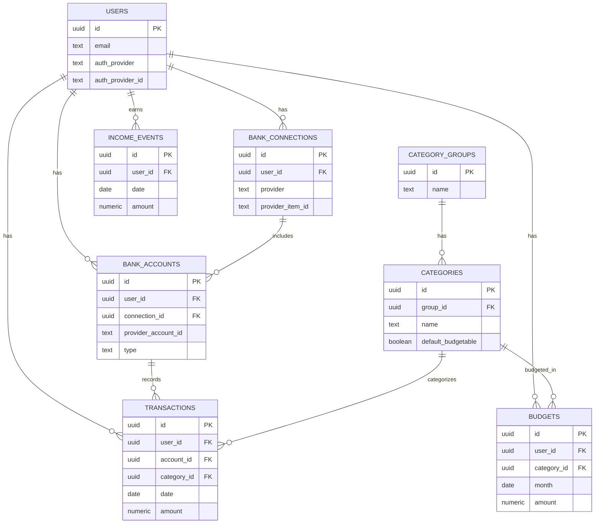

# FinWin

## opensource AI Budget + Simulated Portfolio App

### Technical Architecture (v0.1)

---

# Overview

FinWin is a financial analysis and investing simulation platform that allows users to:

- Connect their bank accounts
- Analyze spending and budgeting with AI
- Simulate investing using their real income
- Track portfolio performance over time
- Learn investing through realistic simulations

The platform prioritizes:

- strong type safety
- SQL-based financial modeling
- scalable architecture
- modern React development practices

---

# Core Tech Stack

## Frontend

Framework

- Next.js
- TypeScript
- Bun

UI System

- TailwindCSS
- shadcn/ui

Data Fetching

- TanStack Query

API Layer

- tRPC

Why tRPC

- End-to-end type safety
- Shared types between backend and frontend
- Eliminates manual API schemas
- Excellent developer experience

Example usage

```tsx
trpc.transactions.getAll()
trpc.portfolio.buyStock()
trpc.portfolio.getValue()
```

# **Charts & Visualization**

The application will use **two chart systems**.

---

## **1. Dashboard Charts**

Library

- Recharts
- shadcn chart components

Used for

- Spending by category
- Monthly cashflow
- Savings rate
- Budget vs actual
- Asset allocation

Why

- React-first library
- Integrates well with shadcn UI
- Easy styling with Tailwind
- Fast development

Documentation

https://recharts.org/

---

## **2. Portfolio / Market Charts**

Library

- TradingView Lightweight Charts

Used for

- Stock price charts
- Portfolio value over time
- Investment performance charts

Benefits

- Optimized for financial time series
- Zoom and crosshair support
- High performance for large datasets

Documentation

https://www.tradingview.com/lightweight-charts/

---

# **Backend Architecture**

Backend logic will run using:

- Next.js server runtime
- tRPC procedures

Instead of REST endpoints, the system exposes **typed procedures**.

Example

```tsx
export const portfolioRouter = router({
  buyStock: publicProcedure
    .input(z.object({
      symbol: z.string(),
      shares: z.number()
    }))
    .mutation(async ({ input }) => {
      // trading logic
    }),
});
```

Benefits

- Fully typed API
- Less boilerplate
- Faster development

---

# **Database**

Provider

- Neon

Database

- PostgreSQL

Documentation

https://neon.tech/

Why Neon

- Serverless Postgres
- Generous free tier
- Easy scaling
- Compatible with modern ORMs

---

# **ORM**

ORM

- Drizzle ORM

Documentation

https://orm.drizzle.team/

Why Drizzle

- SQL-first design
- Lightweight
- Excellent TypeScript support
- Easier query control than Prisma

Example schema

```tsx
export const users = pgTable("users", {
  id: serial("id").primaryKey(),
  email: text("email").notNull(),
});
```

# **Authentication**

- Clerk

---

# **Financial Data Integration**

Bank Data Provider

- Plaid

Documentation

[https://plaid.com/](https://plaid.com/docs/)

Capabilities

- Bank account linking
- Transaction import
- Account balances

MVP Strategy

1. Use Plaid sandbox
2. Import transactions
3. Categorize spending
4. Run AI insights

---

# **Portfolio Simulation System**

The app simulates investing using **virtual money derived from income**.

Initial Model

Simple investing only.

Supported actions

- Buy shares
- Sell shares
- Track positions
- Track portfolio value

# **Core Database Tables**

```tsx
users

bank_accounts
transactions
transaction_categories
budgets
income_events

ai_insights
```

# **AI System Design**

The AI will **not compute financial metrics directly**.

Instead the system uses a **two-layer model**.

---

## **Layer 1 — Deterministic Financial Analysis**

The backend calculates:

- total income
- total expenses
- savings rate
- category spending
- recurring subscriptions
- spending trends

Example

```tsx
{
  "income": 4200,
  "expenses": 3100,
  "food_spending": 700,
  "top_category": "restaurants",
  "subscription_count": 6
}
```

## **Layer 2 — AI Explanation**

The AI converts the structured data into insights.

Example

"You spent 22% more on restaurants this month compared to last month."

This ensures

- accuracy
- deterministic financial calculations
- useful insights

---

# **Infrastructure**

Frontend Hosting

- Vercel

Database

- Neon Postgres

Future infrastructure additions

- Background workers
- Job queues
- Stock price ingestion services
- AI insight generation workers

---

# **MVP Feature Scope**

Version 1 will include

1. Authentication
2. Bank account connection
3. Transaction import
    1. catecgorry confidence 
4. Budget dashboard
5. Spending analytics
6. Simulated investing
7. Portfolio tracking
8. AI financial insights

---

# **Future Features**

Planned roadmap

- Dividend simulation
- Stock splits
- Tax lot tracking
- Investment strategy simulation
- Long-term financial projections
- Goal-based investing
- AI financial planning

```markdown
# FinWin Data Model v0.1
Two-level default categories, banking transactions, budgets, and income events.

---

## Conventions

### Money sign convention (recommended)
- `transactions.amount` is **positive = expense (money out)**, **negative = income/refund (money in)**.
- This makes budgeting “spent so far” naturally `SUM(amount)` for expenses, with a filter to exclude negative amounts.

### IDs
- Use `uuid` PKs for all tables.

### “Spent so far”
- Do **not** store `spent_so_far` on `budgets`. It is derived from `transactions` by month and category.

---

# 1) category_groups
Top-level categories (parents). Examples: Food, Transport, Bills, Income.

### Columns
- `id` uuid **PK**
- `name` text **UNIQUE NOT NULL**
- `sort_order` int **NOT NULL DEFAULT 0**
- `created_at` timestamptz **NOT NULL DEFAULT now()**

### Indexes
- Unique index on `name`

### Notes
- `sort_order` is only for UI ordering.
- Default-only for now (global seed data, not user-generated).

---

# 2) categories
Subcategories under a group. Examples: Food → Groceries, Food → Restaurants.

### Columns
- `id` uuid **PK**
- `group_id` uuid **FK -> category_groups.id NOT NULL**
- `name` text **NOT NULL**
- `default_budgetable` boolean **NOT NULL DEFAULT true**
- `sort_order` int **NOT NULL DEFAULT 0**
- `created_at` timestamptz **NOT NULL DEFAULT now()**

### Constraints
- **UNIQUE (group_id, name)**

### Indexes
- Index on `group_id`
- Unique index on `(group_id, name)`

### Notes
- Transactions get assigned to `categories.id` (subcategory level).
- Set `default_budgetable = false` for subcategories under Income/Transfers.

---

---

# 3) Users
Represents application users who own accounts, transactions, budgets, and portfolios.

### Columns
- `id` uuid **PK**
- `email` text **UNIQUE NOT NULL**
- `name` text NULL
- `avatar_url` text NULL
- `auth_provider` text **NOT NULL** (example: `clerk | authjs | google`)
- `auth_provider_id` text **NOT NULL** (external auth user id)
- `default_currency` text **NOT NULL DEFAULT 'CAD'**
- `timezone` text **NOT NULL DEFAULT 'UTC'**
- `created_at` timestamptz **NOT NULL DEFAULT now()**
- `updated_at` timestamptz **NOT NULL DEFAULT now()**

### Indexes
- Unique index on `email`
- Index on `(auth_provider, auth_provider_id)`

### Notes
- All financial records are scoped to `user_id`.
- Authentication is handled by an external provider (Clerk or Auth.js), but the application keeps a local `users` table for relationships and metadata.
- `default_currency` allows future support for multi‑currency users.
- `timezone` is important for correctly grouping transactions and budgets by month.

---

# 4) bank_connections
Represents a bank login/institution connection (Plaid “Item”).

### Columns
- `id` uuid **PK**
- `user_id` uuid **FK -> users.id NOT NULL**
- `provider` text **NOT NULL** (example: `plaid`)
- `provider_item_id` text **UNIQUE NOT NULL**
- `access_token_encrypted` text **NOT NULL**
- `status` text **NOT NULL** (example: `active | error | revoked`)
- `last_cursor` text NULL (for Plaid transactions sync)
- `created_at` timestamptz **NOT NULL DEFAULT now()**
- `updated_at` timestamptz **NOT NULL DEFAULT now()**

### Indexes
- Index on `user_id`
- Unique index on `provider_item_id`

### Notes
- Store access tokens encrypted at rest.
- `last_cursor` enables incremental sync (faster and cheaper than full backfills).

---

# 5) bank_accounts
Accounts under a connection (checking, credit card, etc). Plaid “Account”.

### Columns
- `id` uuid **PK**
- `user_id` uuid **FK -> users.id NOT NULL**
- `connection_id` uuid **FK -> bank_connections.id NOT NULL**
- `provider_account_id` text **UNIQUE NOT NULL**
- `name` text **NOT NULL**
- `type` text **NOT NULL** (example: `depository | credit | loan | investment`)
- `subtype` text NULL
- `mask` text NULL
- `currency` text **NOT NULL DEFAULT 'CAD'**
- `is_active` boolean **NOT NULL DEFAULT true**
- `created_at` timestamptz **NOT NULL DEFAULT now()**

### Indexes
- Index on `user_id`
- Index on `connection_id`
- Unique index on `provider_account_id`

### Notes
- Keep `user_id` here even though it is derivable through connection, it simplifies filtering and indexing.

---

# 6) transactions
Core banking ledger (imported transactions).

### Columns
- `id` uuid **PK**
- `user_id` uuid **FK -> users.id NOT NULL**
- `account_id` uuid **FK -> bank_accounts.id NOT NULL**
- `provider_transaction_id` text **UNIQUE NOT NULL**
- `date` date **NOT NULL**
- `authorized_date` date NULL
- `name` text **NOT NULL** (transaction description)
- `merchant_name` text NULL
- `amount` numeric(12,2) **NOT NULL**
- `currency` text **NOT NULL DEFAULT 'CAD'**
- `pending` boolean **NOT NULL DEFAULT false**
- `category_id` uuid NULL **FK -> categories.id**
- `category_confidence` numeric(3,2) NULL (0.00–1.00, for future auto-categorization)
- `notes` text NULL
- `created_at` timestamptz **NOT NULL DEFAULT now()**

### Indexes
- Index on `(user_id, date)`
- Index on `(account_id, date)`
- Index on `(user_id, category_id, date)`

### Notes
- `category_id` is nullable so you can support “Uncategorized”.
- If Plaid updates a pending transaction into a posted one, you update the same row (because provider_transaction_id stays stable in most cases).
- For “spent so far”, you will typically sum only expenses: `amount > 0`.

---

# 7) budgets
Monthly budget per user per subcategory.

### Columns
- `id` uuid **PK**
- `user_id` uuid **FK -> users.id NOT NULL**
- `category_id` uuid **FK -> categories.id NOT NULL**
- `month` date **NOT NULL** (store as first day of month, example `2026-03-01`)
- `amount` numeric(12,2) **NOT NULL**
- `created_at` timestamptz **NOT NULL DEFAULT now()**

### Constraints
- **UNIQUE (user_id, category_id, month)**

### Indexes
- Index on `(user_id, month)`
- Index on `(user_id, category_id, month)`
- Unique index on `(user_id, category_id, month)`

### Notes
- “Spent so far” is derived from transactions:
  - filter by `user_id`
  - filter by `category_id`
  - filter by `date` within the budget month
  - sum `amount` where `amount > 0` (if using the positive=expense convention)

Suggested query logic (conceptual)
```sql
SELECT
  b.user_id,
  b.category_id,
  b.month,
  b.amount AS budget_amount,
  COALESCE(SUM(t.amount) FILTER (WHERE t.amount > 0), 0) AS spent_so_far
FROM budgets b
LEFT JOIN transactions t
  ON t.user_id = b.user_id
 AND t.category_id = b.category_id
 AND t.date >= b.month
 AND t.date < (b.month + INTERVAL '1 month')
GROUP BY b.user_id, b.category_id, b.month, b.amount;

```

---

# 8) income_events (recommended)
Normalizes income events to support investing contributions and forecasting.

### Columns
- `id` uuid **PK**
- `user_id` uuid **FK -> users.id NOT NULL**
- `source` text **NOT NULL** (example: `manual | detected | recurring_rule`)
- `date` date **NOT NULL**
- `amount` numeric(12,2) **NOT NULL**
- `description` text NULL
- `created_at` timestamptz **NOT NULL DEFAULT now()**

### Indexes
- Index on `(user_id, date)`
- Index on `(user_id, source)`

### Notes
- This table normalizes income events so they can be used consistently for investing contributions and financial forecasting.
- Sources may include manual user input, detected payroll deposits from bank transactions, or system-generated recurring income rules.
- These events can drive automatic virtual investment contributions (e.g., investing a percentage of each paycheck).

---

# Seed Data (Defaults)

## category_groups examples
- Food
- Transport
- Bills
- Housing
- Shopping
- Entertainment
- Health
- Travel
- Income
- Transfers

## categories examples

Food
- Groceries
- Restaurants
- Coffee
- Fast Food

Transport
- Gas
- Transit
- Parking
- Rideshare

Bills
- Phone
- Internet
- Insurance
- Subscriptions

Income
- Paycheck
- Refund

Transfers
- Transfer In
- Transfer Out

---

# Future additions (not in v0.1)
- `merchants` + merchant mapping rules (for better categorization)
- `recurring_rules` (for subscriptions and paychecks)
- `budget_rollups` / materialized views (only if performance becomes a problem)
- Investing tables: `symbols`, `prices_daily`, `portfolios`, `portfolio_trades`, etc (to be designed next)

---

## ER Diagram (v0.1)



``` 

